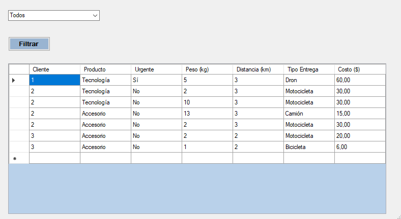

# PedidosApp

Aplicación de escritorio Windows Forms en C# para la gestión de pedidos de la tienda virtual TechExpress.

Automatizar la asignación de métodos de entrega para sus pedidos. 
Dependiendo del tipo de producto (tecnología, accesorio o componente) y la urgencia del pedido, se asigna un medio de transporte distinto, con una tarifa específica
por kilómetro.

# Características
- Asigna automáticamente el método de entrega (dron, motocicleta, camión) según el tipo de producto, urgencia y peso.
- Calcula el costo del envío basado en la distancia.
- Registra todos los pedidos utilizando el patrón Singleton.
- Aplicación de POO, Principios SOLID, y Patrones Strategy y Factory Method.

# Tecnologías
- C# (.NET Framework)
- Windows Forms

# Reglas de negocio
- Tecnología + Urgente → Dron (20 * km)
- Accesorio → Motocicleta (10 * km)
- Componente o Peso > 10kg → Camión (5 * km)

# Funcionamiento
1. El usuario ingresa el nombre del cliente.
2. Selecciona el tipo de producto.
3. Indica si es un pedido urgente.
4. Ingresa el peso del producto y la distancia en kilómetros.
5. Al presionar "Calcular", se muestra el tipo de entrega y el costo.

# Nuevas funcionalidades agregadas (Continuación)

- Nueva estrategia de entrega ecológica en bicicleta (3 * km).
- Formulario de historial de pedidos con DataGridView.
- Filtro por tipo de entrega mediante ComboBox.

  ## Capturas de la Parte 2
#Formulario

# Pedido realizado

# Historial de pedidos

# Historial filtrado

